# Improved U-Net

**Author**: Thomas Day (46986791)

**Chosen Project**: Project 3 (Normal Difficulty)

---
## Introduction
The aim of this project is to adapt the "Improved U-Net" architecture [1] to segment 2D Magnetic Resonance Imaging (MRI) scans of human hips into six distinct classes. This report will explore the model architecture, training process, and results of this task. Success will be measured by all labels having a minimum Dice-Sørensen (Dice) coefficient of 0.75.

## Table of Contents

0. [Introduction](#Introduction)
1. [Table of Contents](#table-of-contents)
2. [Dataset](#Dataset)
3. [Introduction to Improved U-Net](#improved-u-net)
4. [Training Setup](#training-setup)
5. [Training](#training)
6. [Results](#results)
7. [Running Instructions](#running)
8. [References](#references)


## Dataset
As specified by the task sheet, the Improved U-Net model will be trained on the HipMRI Study on prostate cancer [2] dataset. This dataset contains 12,660  greyscale images from MRI scans of the male human pelvis. These images were divided into train, validation, and test of sizes 11,460, 660, and 540 respectively. These are these default splits of the HipMRI dataset. It was decided to use the default splits that come with the dataset to improve the reproducibility of the training as well as fulfil the original brief of project 3, which specifies that the test split of the HipMRI dataset must achieve over 0.75 minimum per-class DICE.

| Split    | Number of samples | Purpose                                                                          |
|----------|:-----------------:|----------------------------------------------------------------------------------|
| Train    | 11,460             | Used to fit the model.                                                           |
| Validate | 660               | Used to tune hyperparameters, monitor training progress, and detect overfitting. |
| Test     | 540               | Used to test how well the final model performs. Not used until after training.   |

*Figure 1: A table describing the train, validate, and test splits.*

In addition to the 12,660 MRI, the dataset includes scan images are corresponding ground-truth segmentation labels, which assign each pixel in each given image to one of six classes including background. Figure 2 describes these 6 classes below.

| Class ID | Label      | Example Ground Truth Segmentation    |
| -------- | ---------- | ------------------------------------ |
| 0        | Background | 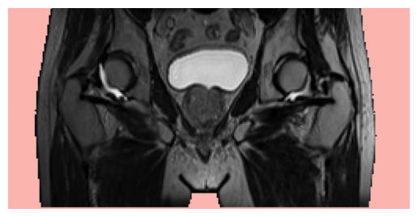 |
| 1        | Body       | 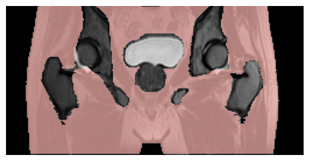 |
| 2        | Bones      | 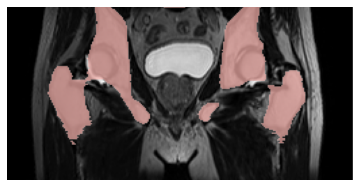 |
| 3        | Bladder    | 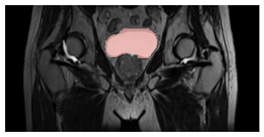 |
| 4        | Rectum     | 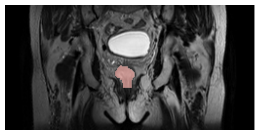 |
| 5        | Prostate   | 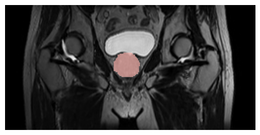 |

*Figure 2: A table demonstrating the classes from the HipMRI dataset [2]. Classes 0, 1, 2, 3, and 5 example taken from train image 567, class 4 example taken from train image 582*

### Dataset processing
The HipMRI dataset was given in the form of several directories containing gzipped Nifti format files. These files aren't immeadiatlet usable, and thus required pre-processing. The processing steps applied to them are as follows:
1. File decompressed and loaded into numpy ndarrays. (using the task sheet provided code from appendix B).
2. If the Nifti file contained an image slice, the values were z-score normalised (using the task sheet provided code from appendix B).
3. The images and segmentations were then scaled to a uniform resolution of 256x128.
4. Data augmentations are applied (only on train dataset images).
5. The segmentation masks are one-hot encoded.

## Improved U-Net

### Background
In 2015, Ronneberger et al. [3] published "U-Net: Convolutional Networks for Biomedical Image Segmentation", which introduced the novel "U-Net" convolution neural network architecture. This architecture incorporated the idea of adding "skip connections" to the encoder-decoder architecture, enabling more precise segmentations.

<p align="center">
    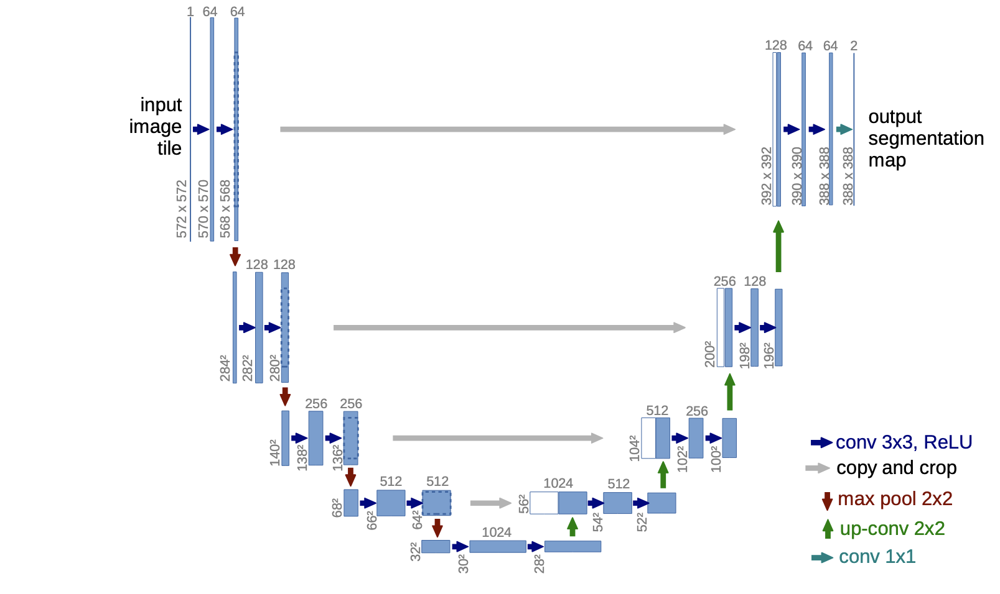
</p>


<p align="center">
    <em>Figure 3: The original U-Net architecture. Diagram from the original paper [3]</em>
</p>

The original U-Net's encoder consisted of 5 levels, each using two 3x3 convolutions with an ReLU activation function. The decoder consisted of the same architecture, except it was mirrored, increasing the spatial features using up-convolutions (transposed convolutions) and it also accepted the input from the skip connections at each level. 

### Improved U-Net Architecture

In 2018, Isensee et al. released an "Improved U-Net" paper [1], that built upon the work on Renneberger at al. to create a U-Net-like network that could operate on three-dimensional data and achieve improved state of the art accuracy. While the Improved U-Net paper was originally intended for three-dimensional data, as per the task description (project 3) this report will adapt it for two-dimensional data. Therefore, the following description of the architecture will be for a two-dimensional variation of the Improved U-Net paper, rather than the original three-dimensional architecture.

<p align="center">
    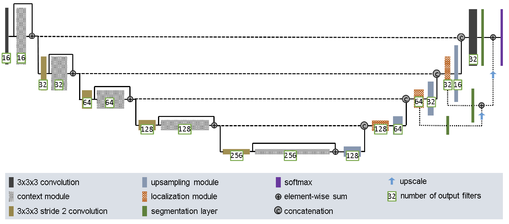
</p>

<p align="center">
    <em>Figure 4: The Improved U-Net diagram, taken from the original paper [1]</em>
</p>

### Encoder
The encoder section improved upon the original U-Net implementation by introducing context modules, which are based on pre-activation residual blocks introduced by He et al. in "Identity Mappings in Deep Residual Networks" [4]. The Context modules consist of two layers containing instance normalisation, LeakyReLU, and a convolution, with a dropout layer in-between. The residual is taken at the start of the block and summed to the output of the two layers.


<p align="center">
    
</p>

<p align="center">
    <em>Figure 5: Block diagram of the context module</em>
</p>


With the exception of the final layer, the output of each context module is saved to later be passed to the decoder through a skip connection before finally being downscaled using a 3x3 convolution with a stride of 2.


### Decoder
The decoder section also improves on that of the original U-Net paper. First, localisation modules are introduced. These modules take the previous layer's features, concatenated with the features received from the skip connection, as input. Then, it feeds this input through a 3x3 convolution followed by a 1x1 convolution that halves the number of features.

The next component in the decoder is the upsampling module. This module aims to reduce the checkerboard artefacts often introduced by upscaling with transposed convolutions. It achieves this by simply upscaling the input by repeating each feature twice, before applying a standard convolution and activation function. 

The final contribution in the decoder is the addition of "deep supervision" to the U-Net architecture. Broadly speaking, this mechanism works by passing the output of the top three levels in the decoder through segmentation layers, upscaling them to the same resolution, and then summing them, giving the final segmented output.


### Loss function
The original U-Net paper used a weighted cross-entropy loss function. The rationale behind this loss function was that the weights could be used to weight underrepresented classes higher, thereby balancing the loss from the different classes.

Improved U-Net replaces this loss function with multiclass Dice loss. This loss function was chosen to address the high degree of class imbalance often observed in medical datasets. Because this loss function computes the overlap on a per-class basis before then averaging, all classes are equally weighted, thereby solving this issue.

<p align="center">
    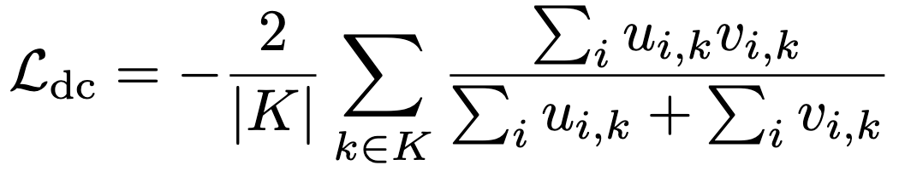
</p>
<p align="center">
    <em>Figure 6: The multiclass DICE loss used in Improved U-Net</em>
</p>

## Training Setup
  
### Original Training Setup
In the Improved U-Net paper, the authors describe the following training setup:
- Batch size 2
- an initial learning rate of $5 \times 10^{-4}$, with exponential decay following the schedule $\text{lr}_{init} \cdot 0.985^{\text{epoch}}$
- weight decay of $10^{-5}$
- Adam optimiser
- Extensive Augmentations

Our training implementations will need to make reasonable deviations from the paper's original setup. This change is required because this implementation is focusing on two-dimensional data and because significantly more powerful GPUs have become available since the paper was authored in 2018.

### Data augmentations
In the Improved U-Net paper [1] they made extensive use of augmentations applied on the fly during training. As such, in this implementation similar augmentations were used. The "transforms v2" API  within Pytorch TorchVision, as the transformations applied to the image and the segmentation mask must be the same, and the "transforms v2" API supports this use case. The following snippet shows the transforms used.

```py
transforms = v2.Compose([
	v2.RandomVerticalFlip(p=0.5), 
	v2.ElasticTransform(alpha=75.0, sigma=10.0),
	v2.RandomRotation(10),
	v2.RandomAffine(degrees=0, scale=(0.9, 1.1)),
])
```

The parameters of the transforms were not given in the paper, and as such had to be derived manually. The parameters (shown in the snippet above) were determined through a process of visual inspection, selecting the largest possible augmentations that still appeared as if they could reasonably be real MRIs.

One issue that presented itself with the augmentations was that applying the augmentations directly to the one-hot encoded masks led to an edge case where if an augmentation introduced additional background class (i.e. a rotation). It would not be counted in the background class of the mask. This was solved by only converting the segmentations masks to one-hot encoding after the augmentations were applied.

### Hyperparameter Tuning
While the justification for the extremely low batch size of two is not explicitly stated in the Improved U-Net paper, it is implied to be due to VRAM constraints. Since both two-dimensional data is significantly more compact than three-dimensional data and since more powerful GPUs are available, it is logical to increase the original batch size from two to a larger number.

Additionally, when batch size is changed, the optimal learning rate often changes too. In the paper, a conservative initial learning rate of  $5 \times 10^{-4}$ is used. This would likely be unsuitable for an increased batch size.

Therefore, an experiment was conducted wherein the batch size and learning rate space was grid searched, in order to find the optimal combination. Exponentially increasing batch sizes were tested from 8 to 128. For each batch size, a range of initial learning rates were tested from 0.0001 to 0.02. The results of this parameter search are shown below in figure 7.

<p align="center">
    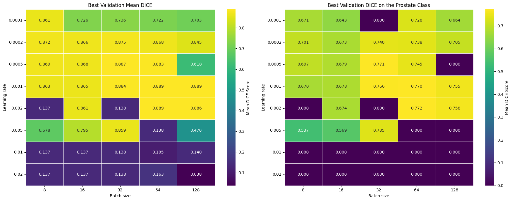
</p>
<p align="center">
    <em>Figure 7: Results of the hyperparameter grid search. Table 1 (left) contains the Best validation mean DICE score from each parameter combination. Table 2 (right) contains the mean dice for the prostate class</em>
</p>

As shown in figure 7, it can be observed that a batch size of 64 combined with learning a learning rate of 0.002 resulted in the highest mean DICE score on the validation dataset. The metric by which project success is measured is having a minimum DICE score across all classes of at least 0.75. Therefore, another logical metric would be the best validation DICE on the most difficult class, the prostate. The second table in figure 7 indicates that the batch size of 64 combined with the learning rate of 0.002 also performs best for this metric.

## Training
Based on the findings of the hyperparameter search, an extended training run was performed with the following parameters:

| Parameter     | Value                                     |
| ------------- | ----------------------------------------- |
| Batch size    | 64                                        |
| Learning rate | 0.002                                     |
| Augmentations | As described in the augmentations section |
| Weight decay  | $10^{-5}$                                 |
| epochs        | 35                                        |
| GPU           | NVIDIA GeForce RTX 4080                   |

*Figure 8: Training run parameters*

Throughout training, the loss value for both the training and validation datasets was recorded. These results are presented below in Figure 9:

<p align="center">
    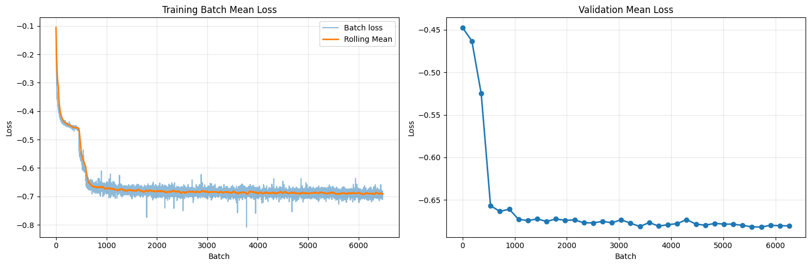
</p>
<p align="center">
    <em>Figure 9: Plots of the training loss measured per-batch (left) and the mean validation loss per epoch (right).</em>
</p>
 

Similarly, the DICE score for both the training and validation datasets were recorded throughout training:

 <p align="center">
    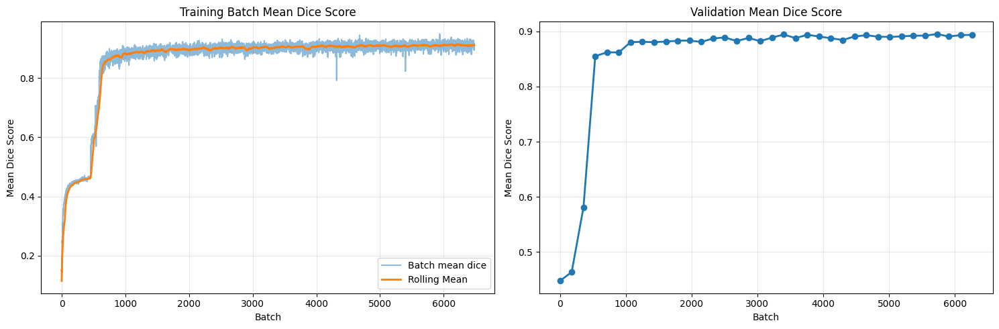
</p>
<p align="center">
    <em>Figure 10: Plots of the training DICE measured per-batch (left) and the mean validation DICE per epoch (right).</em>
</p>

Finally, since the key metric for this project is achieving a minimum DICE score of 0.75 on all labels, the DICE score for each of the 6 classes was recorded throughout training. This is shown below in Figure 11:

 <p align="center">
    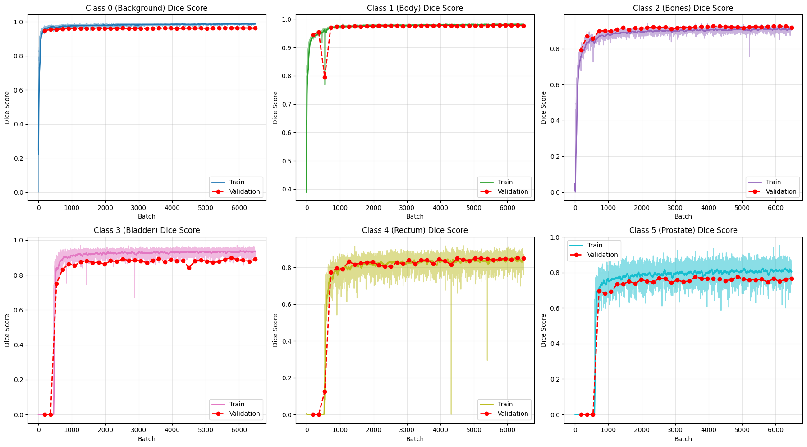
</p>
<p align="center">
    <em>Figure 11: Plots of the DICE mean score per class throughout the training run on the test and validation datasets.</em>
</p>

### Analysis of Training
When observing the loss curves (Figure 9) and the accuracy curves (Figure 10) a peculiar artefact can be seen around the 500 batches mark. The loss appears to plateau before rapidly descending again. This artefact can be explained by the per-class DICE scores (Figure 11). When observing these DICE score curves, the first 3 classes (background, body, and bones) dramatically increase in accuracy very quickly, with the rate of improvement already beginning to plateau by the 500th batch. The latter 3 classes (bladder, rectum, and prostate), on the other hand, do not see any improvements until around the 500th batch, at which point their accuracy improves significantly. Therefore,this artefact in the loss and accuracy curves can be explained by the "easier" larger classes being learnt before the "harder" more intricate classes.

Other than this artefact, the loss curves appear typical for a convolutional neural network, with the training loss eventually plateauing and the validation accuracy close but ever so slightly worse than the train accuracy.

## Results
The benchmark for this project to be successful was for a model to be produced that could segment images in the test dataset with a minimum DICE score of at least 0.75. This model was able to fulfil this requirement, as shown by the test dataset results in figure 12:

| Class    | Class 0 (Background) | Class 1 (Body) | Class 2 (Bones) | Class 3 (Bladder) | Class 4 (Rectum) | Class 5 (Prostate) |
| -------- | -------------------- | -------------- | --------------- | ----------------- | ---------------- | ------------------ |
| **DICE** | 0.9689               | 0.9774         | 0.9183          | 0.9436            | 0.8060           | 0.7714             |

*Figure 12: The per-class DICE scores on the test dataset*

To further confirm the accuracy of the model, example segmentations were predicted on the test dataset, shown below in figures 13 and 14.

<p align="center">
    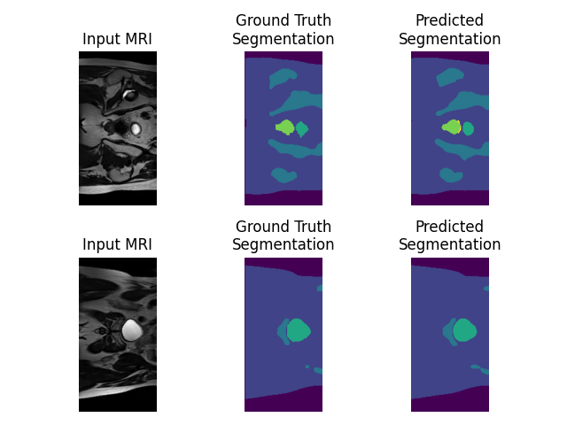
</p>
<p align="center">
    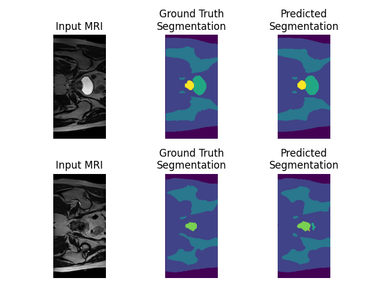

</p>
<p align="center">
    <em>Figure 13: Four random sample predictions from the network (right) compared against the input (left) and the ground truth (centre).</em>
</p>


<p align="center">
    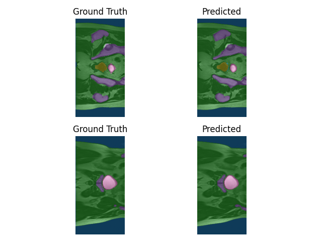
</p>
<p align="center">
    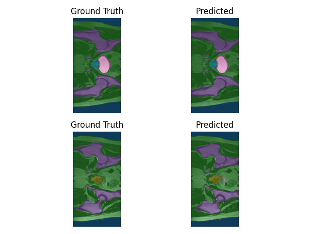

</p>
<p align="center">
    <em>Figure 14: The four random sample predictions from figure 13, overlaid on top of the input image. Ground truth is on the left, while prediction is on the right</em>
</p>


## Running

### File Structure
The following are the purposes of the important files in the repository:
| File               | Purpose                                                                                                                        |
| ------------------ | ------------------------------------------------------------------------------------------------------------------------------ |
| **dataset.py**     | Contains the code that constructs the Pytorch dataset from the raw HipMRI dataset files.                                       |
| **grid_search.py** | A lightweight python script that can be run to conduct a grid search across different model parameters.                        |
| **module.py**      | Contains the modules/classes that are used to construct the model object. E.g. the `ImprovedUNet` and `ContextModule` classes. |
| **predict.py**     | A script that, when run, can use given model weights to make a prediction.                                                     |
| **train.py**       | A script that trains the model.                                                                                                |
| **utils.py**       | Arbitrary utility functions called by other scripts in the repository. E.g. Dice loss, Dice score, dataset augmentations.      |


### Dependencies
This project depends on the following python libraries:
```
torch
numpy
nibabel
scipy
torchvision
tqdm
pandas
matplotlib
```

The specific versions of the libraries and their dependencies used can be found in the `requirements.txt` file, and can be loaded using:
```bash
pip install -r requirements.txt
```

### Training
The `train.py` script is used to train the model. It can be called as follows:
```bash
python train.py \
    -o ./checkpoints \
    -d /home/groups/comp3710/HipMRI_Study_open/keras_slices_data \
    -e 35 \
    -bs 64 \
    -lr 0.002 \
    --device cuda
```

with the following command-line arguments:
| Shorthand | Longhand                    | Purpose                                                  | Required? |
| --------- | --------------------------- | -------------------------------------------------------- | --------- |
| -e        | --epochs                    | The number of epochs to train for.                       | No        |
| -d        | --dataset-dir               | The directory containing the 2D HipMRI dataset           | No        |
| -lr       | --learning-rate             | The learning rate to train with.                         | No        |
| -lrd      | --learning-rate-decay-gamma | The gamma argument passed to the learning rate scheduler | No        |
| -bs       | --batch-size                | The batch size to train with                             | No        |
| -o        | --output-dir                | The directory to output training data to                 | No        |
|           | --device                    | The accelerator to train with                            | No        |

### Inference
The `predict.py` script can be used to generate sample predictions. It can be called as follows:
```bash
python predict.py \
    -o ./pred \
    -d /home/groups/comp3710/HipMRI_Study_open/keras_slices_data \
    -m ./checkpoint/epoch_35.pth \
    -c 2 \
```

With the following command line arguments:
| Shorthand | Longhand      | Purpose                                                    | Required? |
| --------- | ------------- | ---------------------------------------------------------- | --------- |
| -m        | --model-dir   | The model weights that will be used to make the prediction | Yes       |
| -o        | --output-dir  | The directory to output the predictions to                 | No        |
| -c        | --count       | The number of predictions to make                          | No        |
| -d        | --dataset-dir | The directory containing the 2D HipMRI dataset             | No        |


## References
**[1]** F. Isensee, P. Kickingereder, W. Wick, M. Bendszus, and K. H. Maier-Hein, “Brain Tumor Segmentation and Radiomics Survival Prediction: Contribution to the BRATS 2017 Challenge,” in Brainlesion: Glioma, Multiple Sclerosis, Stroke and Traumatic Brain Injuries, A. Crimi, S. Bakas, H. Kuijf, B. Menze, and M. Reyes, Eds., Cham: Springer International Publishing, 2018, pp. 287–297.

**[2]** J. Dowling and P. Greer, “Labelled weekly MR images of the male pelvis.” CSIRO, 2021. doi: 10.25919/45T8-P065.

**[3]** O. Ronneberger, P. Fischer, and T. Brox, “U-Net: Convolutional Networks for Biomedical Image Segmentation,” in Medical Image Computing and Computer-Assisted Intervention – MICCAI 2015, N. Navab, J. Hornegger, W. M. Wells, and A. F. Frangi, Eds., Cham: Springer International Publishing, 2015, pp. 234–241.

**[4]** K. He, X. Zhang, S. Ren, and J. Sun, “Identity Mappings in Deep Residual Networks,” in Computer Vision – ECCV 2016, B. Leibe, J. Matas, N. Sebe, and M. Welling, Eds., Cham: Springer International Publishing, 2016, pp. 630–645.

